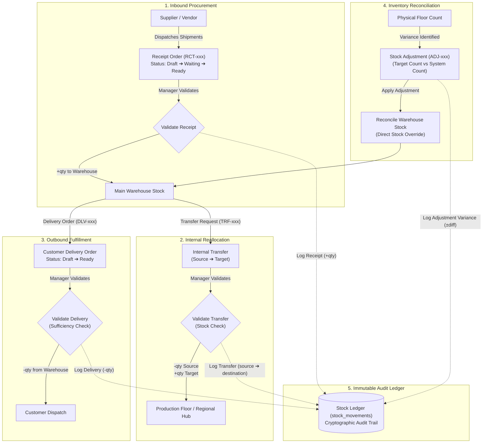
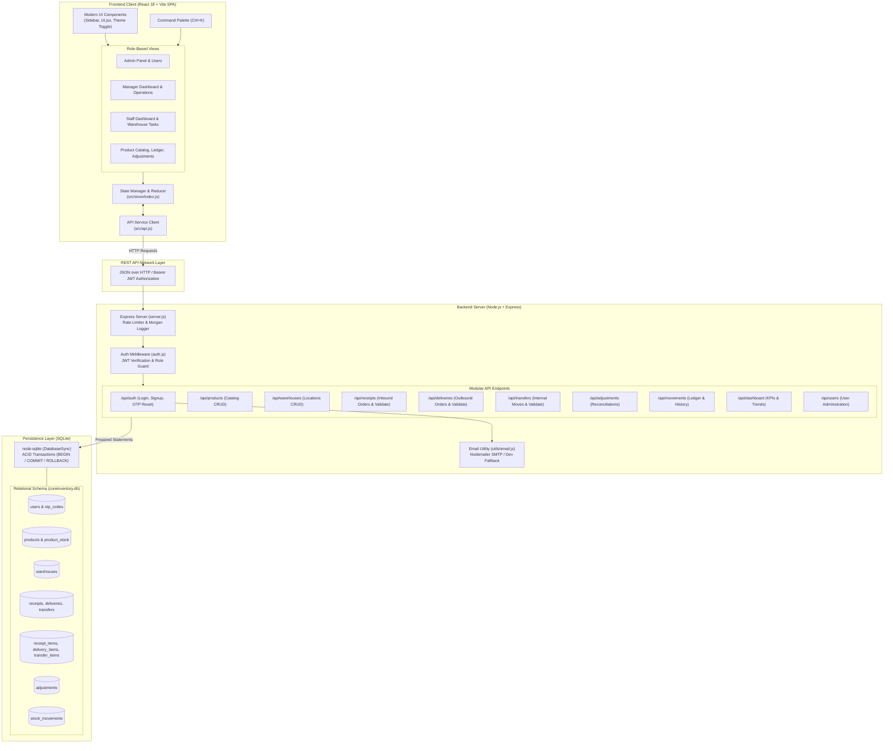

# 📦 StockSense (ODDOxLPU-StockSense)
### *Modular Multi-Warehouse Inventory Management & Stock Ledger System*

[](https://nodejs.org/)
[](https://expressjs.com/)
[](https://react.dev/)
[](https://vitejs.dev/)
[](https://sqlite.org/)
[](https://jwt.io/)

---

## 🏆 Hackathon Project Overview

> **Submission for**: `[Insert Event Name, e.g., Odoo x LPU Hackathon 2026]`  
> **Team Name**: `[Insert Team Name]`  
> **Live Demo**: `[Insert Live Demo URL or N/A]`  
> **Demo Video**: `[Insert Video Presentation / Loom Link]`  
> **Repository**: [github.com/dhyeyptl10/ODDOxLPU-StockSense](https://github.com/dhyeyptl10/ODDOxLPU-StockSense.git)

```
       _____ _             _    _____                      
      / ____| |           | |  / ____|                     
     | (___ | |_ ___   ___| | _| (___   ___ _ __  ___  ___ 
      \___ \| __/ _ \ / __| |/ /\___ \ / _ \ '_ \/ __|/ _ \
      ____) | || (_) | (__|   < ____) |  __/ | | \__ \  __/
     |_____/ \__\___/ \___|_|\_\_____/ \___|_| |_|___/\___|
     Precision Inventory Tracking & Ledger Reconciliation
```

StockSense is an inventory management platform engineered to eliminate paper registers, fragmented spreadsheets, and untracked stock drift. Built around double-entry stock principles inspired by modern ERPs, StockSense unifies multi-warehouse tracking, role-based workflows, automated reorder tracking, transactional stock movements, and an immutable audit ledger into a cohesive, high-performance web application.

---

## 📑 Table of Contents

1. [The Problem & The Solution](#-the-problem--the-solution)
2. [Target Users & Role-Based Access Control](#-target-users--role-based-access-control)
3. [Key Features](#-key-features)
4. [Inventory Lifecycle Flow](#-inventory-lifecycle-flow)
5. [System Architecture](#-system-architecture)
6. [Tech Stack](#-tech-stack)
7. [Repository Structure](#-repository-structure)
8. [Installation & Getting Started](#-installation--getting-started)
9. [Stock Update Engine & Business Rules](#-stock-update-engine--business-rules)
10. [End-to-End Demo Walkthrough](#-end-to-end-demo-walkthrough)
11. [API Specification](#-api-specification)
12. [Screenshots](#-screenshots)
13. [Known Limitations & Future Roadmap](#-known-limitations--future-roadmap)
14. [Contributing & Team](#-contributing--team)
15. [License](#-license)

---

## 🛑 The Problem & The Solution

### The Challenge
Modern wholesale, manufacturing, and retail businesses face severe operational bottlenecks when tracking inventory:
- **Disjointed Spreadsheets & Manual Registers**: Stock entries updated on paper or disparate Excel files create immediate data desynchronization.
- **Lack of Multi-Warehouse Visibility**: Stock held at production facilities versus central hubs is obscured, resulting in redundant purchases or missed sales orders.
- **Uncontrolled Inventory Drift**: Deliveries and receipts occur without atomic stock verification, causing negative balances and stockouts.
- **No Traceable Audit Trail**: Physical count discrepancies cannot be mapped back to who made the adjustment, when, or why.

### The StockSense Solution
StockSense provides a single source of truth across all storage locations:
- **Atomic Stock State Machine**: Stock levels never update arbitrarily. Only validated Receipts, Deliveries, Transfers, and Adjustments mutate warehouse quantities inside ACID-compliant transactions.
- **Real-Time Multi-Warehouse Distribution**: Track stock at specific facilities (`Main Warehouse`, `Production Floor`, `Delhi Store`) with instantaneous low-stock warnings.
- **Double-Entry Stock Ledger**: Every inventory transition records matching source/target references, actor IDs, timestamps, and delta quantities (`stock_movements`).
- **Granular Role-Based Access**: Specialized interfaces tailored for Administrators, Inventory Managers, and Warehouse Staff.

---

## 👥 Target Users & Role-Based Access Control

The application implements strict role-based access control (RBAC) enforced both at the UI layer and at the API middleware level (`backend/middleware/auth.js`):

| Role | Responsibilities | Permissions & Accessible Modules |
| :--- | :--- | :--- |
| **Administrator** (`admin`) | System governance, master data, user & facility management | Full access to all modules: User Management (`AdminPanel`), Warehouse Settings, Product Catalog, Operations, Adjustments, and Complete Audit Ledger. |
| **Inventory Manager** (`manager`) | Stock flow control, procurement validation, inventory audits | Access to Manager Dashboard, Product Catalog, Validation/Cancellation of Receipts, Deliveries, Internal Transfers, and Physical Count Adjustments. |
| **Warehouse Staff** (`warehouse_staff`) | Physical execution, picking, shelving, counting | Staff Dashboard, View Products, Draft Receipts & Deliveries, Create Transfer Requests, and Record Physical Count Discrepancies. |

---

## ✨ Key Features

- **Product Master Catalog**:
  - Detailed product profiles including SKU, name, category, unit of measure (`kg`, `pieces`, `liters`, `meters`, `boxes`, `sets`, `tons`), and safety reorder thresholds.
  - Per-warehouse stock breakdown showing exactly where items are distributed.
  - Automatic status indicators (`In Stock`, `Low Stock`, `Out of Stock`).
- **Inbound Receipts (`RCT-xxx`)**:
  - Log incoming shipments from suppliers (e.g., `SteelCo Ltd`, `FurniWorld`, `ChemBase Corp`).
  - Draft, Waiting, and Ready staging states.
  - One-click validation that increases warehouse stock and logs inbound ledger records atomically.
- **Outbound Deliveries (`DLV-xxx`)**:
  - Fulfill customer orders (e.g., `Acme Corp`, `BuildRight Ltd`, `TechSolutions`).
  - Automated pre-validation sufficiency checks: blocks validation and flags shortages if warehouse inventory is insufficient.
  - Reduces stock and writes negative movement entries upon confirmation.
- **Internal Warehouse Transfers (`TRF-xxx`)**:
  - Shift goods between facilities (e.g., from `Main Warehouse` to `Production Floor`).
  - Validates stock at source warehouse before permitting transfer.
  - Net zero delta on overall company inventory while reallocating stock across locations.
- **Physical Inventory Adjustments (`ADJ-xxx`)**:
  - Reconcile physical bin counts against digital system balances.
  - Requires mandatory explanation note (e.g., "Damage in transit", "Counting discrepancy").
  - Directly sets target quantity and logs exact numerical variance into the audit trail.
- **Immutable Stock Ledger (`stock_movements`)**:
  - Centralized historical log capturing every validated inventory event.
  - Filterable by product, warehouse location, date range, and operation type.
- **Executive & Operational Dashboards**:
  - Key performance indicator (KPI) metric cards: Total Products, Units on Hand, Out-of-Stock count, Low-Stock alerts, Pending Receipts, Pending Deliveries, Scheduled Transfers.
  - Category-wise distribution breakdown.
  - 14-day movement trend visual charts powered by Recharts.
- **Authentication & Security**:
  - JWT token-based session management with configurable expiration.
  - Salted password hashing via `bcryptjs` (12 rounds).
  - 6-digit OTP email password reset via Nodemailer with local development console fallback.
  - Rate limiting on API and authentication routes (`express-rate-limit`).
- **Power-User Ergonomics**:
  - Quick Search and Command Palette (`Ctrl+K` / `Cmd+K`).
  - Dark mode and light mode interface themes.

---

## 🔄 Inventory Lifecycle Flow

The diagram below illustrates how inventory enters, moves through, reconciles within, and exits the StockSense ecosystem, feeding every transaction directly into the immutable stock ledger:



---

## 🏛 System Architecture

The StockSense architecture is organized into a clean client-server model with an embedded, zero-dependency SQLite storage engine:



---

## 🛠 Tech Stack

### Frontend
- **Framework**: [React 18.2](https://react.dev/) (Functional components, hooks, `useReducer`)
- **Build Tool**: [Vite 4.4](https://vitejs.dev/) (Rapid HMR and optimized bundler)
- **Data Visualization**: [Recharts 2.8](https://recharts.org/) (Interactive area charts, bar charts, trend lines)
- **Styling**: Vanilla CSS design system with CSS custom properties (`index.css`), responsive layouts, and dark/light mode tokens.
- **Icons & Controls**: Custom lightweight SVG icon library (`components/UI.jsx`).

### Backend
- **Runtime**: [Node.js](https://nodejs.org/) (v22+ with `--experimental-sqlite`)
- **Web Framework**: [Express.js 4.18](https://expressjs.com/)
- **Database Engine**: `node:sqlite` (`DatabaseSync` API — zero native binary compiling issues, high-speed embedded execution)
- **Authentication**: `jsonwebtoken` (JWT) + `bcryptjs` password hashing
- **Security & Validation**: `express-rate-limit`, `express-validator`, `cors`, `morgan`
- **Email Delivery**: `nodemailer` (SMTP transport with safe offline development fallback)
- **ID Generation**: `uuid` (UUIDv4)

---

## 📂 Repository Structure

```
stocksense/
├── backend/                              # Express REST API & Database engine
│   ├── db/
│   │   ├── database.js                   # SQLite connection, pragmas, schema & transaction shim
│   │   ├── seed.js                       # Comprehensive database seeder with demo products & users
│   │   └── coreinventory.db              # SQLite database file (created on init)
│   ├── middleware/
│   │   └── auth.js                       # JWT verification and role authorization middleware
│   ├── routes/
│   │   ├── adjustments.js                # Stock count adjustments & discrepancy logging
│   │   ├── auth.js                       # Signup, login, profile, and OTP password reset
│   │   ├── dashboard.js                  # KPI calculations, category totals, and 14-day trends
│   │   ├── deliveries.js                 # Outbound fulfillment orders & validation
│   │   ├── movements.js                  # Stock ledger history and movement summaries
│   │   ├── products.js                   # Product catalog CRUD & reorder settings
│   │   ├── receipts.js                   # Inbound supplier receipts & validation
│   │   ├── transfers.js                  # Internal warehouse-to-warehouse transfers
│   │   ├── users.js                      # User management (admin only)
│   │   └── warehouses.js                 # Multi-warehouse location CRUD
│   ├── utils/
│   │   ├── email.js                      # Nodemailer SMTP transporter and HTML OTP email template
│   │   └── helpers.js                    # Reference generation, stock adjustments, ledger logging
│   ├── package.json                      # Backend dependencies & run scripts
│   └── server.js                         # Application entry point, CORS, rate limits, route mounts
│
├── frontend/                             # React SPA Client
│   ├── src/
│   │   ├── components/
│   │   │   ├── Sidebar.jsx               # Navigation bar with role filtering and active tabs
│   │   │   └── UI.jsx                    # Reusable modal, badge, button, table, and icon components
│   │   ├── pages/
│   │   │   ├── AdminPanel.jsx            # User accounts management and system overview
│   │   │   ├── Auth.jsx                  # Sign-in, registration, and OTP password reset wizard
│   │   │   ├── Dashboard.jsx             # Executive KPI analytics & stock charts
│   │   │   ├── Landing.jsx               # Marketing / Hackathon hero introduction
│   │   │   ├── ManagerDashboard.jsx      # Inventory manager priority actions & overview
│   │   │   ├── Operations.jsx            # Receipts, Deliveries, and Transfers interfaces
│   │   │   ├── Products.jsx              # Product catalog, stock by warehouse, add/edit modal
│   │   │   ├── Settings.jsx              # Physical Adjustments, Ledger History, Warehouses, Profile
│   │   │   └── StaffDashboard.jsx        # Warehouse floor task queue & quick operations
│   │   ├── store/
│   │   │   └── index.js                  # Global application state reducer, initial dataset, helpers
│   │   ├── api.js                        # Centralized HTTP client wrapping all REST endpoints
│   │   ├── App.jsx                       # Root component: auth checks, role routing, command palette
│   │   ├── index.css                     # Global design tokens, layout styling, dark/light themes
│   │   └── main.jsx                      # Vite React DOM entry point
│   ├── index.html                        # Application HTML shell
│   ├── package.json                      # Frontend dependencies & Vite scripts
│   └── vite.config.js                    # Vite configuration
│
└── README.md                             # Comprehensive project documentation
```

---

## ⚙️ Installation & Getting Started

### Prerequisites
- **Node.js**: v22.0.0 or higher (recommended for built-in `node:sqlite` support).
- **npm**: v9.0.0 or higher.
- **Git**

---

### Step 1: Clone the Repository

```bash
git clone https://github.com/dhyeyptl10/ODDOxLPU-StockSense.git
cd ODDOxLPU-StockSense
```

*(If running from the local project directory structure, navigate into the respective frontend and backend folders).*

---

### Step 2: Configure and Start the Backend

1. Navigate to the backend directory and install dependencies:
   ```bash
   cd backend
   npm install
   ```

2. *(Optional)* Configure environment variables by creating a `backend/.env` file:
   ```env
   PORT=5000
   NODE_ENV=development
   JWT_SECRET=super_secret_stocksense_jwt_key_2026
   JWT_EXPIRES_IN=7d
   FRONTEND_URL=http://localhost:5173

   # Optional: Configure SMTP for real OTP emails (leaves dev fallback active if omitted)
   SMTP_HOST=smtp.gmail.com
   SMTP_PORT=587
   SMTP_USER=
   SMTP_PASS=
   EMAIL_FROM=StockSense <noreply@stocksense.com>
   OTP_EXPIRE_MINUTES=10
   ```

3. Seed the database with demonstration data:
   ```bash
   npm run seed
   ```

4. Start the backend development server:
   ```bash
   npm run dev
   ```
   *The API will start at `http://localhost:5000` with health check available at `http://localhost:5000/health`.*

---

### Step 3: Start the Frontend Application

1. Open a new terminal window, navigate to the frontend directory, and install dependencies:
   ```bash
   cd frontend
   npm install
   ```

2. Start the Vite development server:
   ```bash
   npm run dev
   ```

3. Open your browser and navigate to:
   ```
   http://localhost:5173
   ```

---

### 🔑 Default Demonstration Accounts

The database seed script automatically creates three role-specific test accounts:

| Role | Email Address | Password | Intended Use Case |
| :--- | :--- | :--- | :--- |
| **Administrator** | `admin@coreinventory.com` | `admin123` | Full administrative control, user setup, warehouse creation. |
| **Inventory Manager** | `manager@coreinventory.com` | `manager123` | Approving transfers, validating receipts/deliveries, adjustments. |
| **Warehouse Staff** | `staff@coreinventory.com` | `staff123` | Warehouse floor tasks, drafting requests, checking stock counts. |

---

## 📐 Stock Update Engine & Business Rules

StockSense enforces strict transactional rules on all operations to ensure physical inventory matches digital records at all times:

### 1. Inbound Receipts (`POST /api/receipts/:id/validate`)
- **Pre-Conditions**: Receipt must exist, have at least one line item, and status cannot be `done` or `canceled`. Restricted to Manager and Admin.
- **Stock Math**: For every item in the receipt:
  $$\text{Stock}_{\text{Warehouse}}(\text{Product}) \leftarrow \text{Stock}_{\text{Warehouse}}(\text{Product}) + \text{Item}.\text{Quantity}$$
- **Ledger Entry**:
  - Type: `receipt`
  - Delta: $+\text{Item}.\text{Quantity}$
  - `from_warehouse`: `NULL`
  - `to_warehouse`: Receipt target warehouse ID
  - Reference: Receipt reference (`RCT-xxx`)

---

### 2. Outbound Deliveries (`POST /api/deliveries/:id/validate`)
- **Pre-Conditions**: Status cannot be `done` or `canceled`.
- **Sufficiency Guard**: Before executing, the engine evaluates available stock across all requested items:
  $$\text{Available Stock}_{\text{Warehouse}} \ge \text{Requested Quantity}$$
  If *any* item has insufficient quantity, the entire transaction is rejected with an HTTP `400 Bad Request` specifying the exact shortage.
- **Stock Math**:
  $$\text{Stock}_{\text{Warehouse}}(\text{Product}) \leftarrow \text{Stock}_{\text{Warehouse}}(\text{Product}) - \text{Item}.\text{Quantity}$$
- **Ledger Entry**:
  - Type: `delivery`
  - Delta: $-\text{Item}.\text{Quantity}$
  - `from_warehouse`: Delivery source warehouse ID
  - `to_warehouse`: `NULL`
  - Reference: Delivery reference (`DLV-xxx`)

---

### 3. Internal Transfers (`POST /api/transfers/:id/validate`)
- **Pre-Conditions**: Status must be pending. Origin and destination warehouses must be distinct.
- **Sufficiency Guard**: Verifies sufficient stock exists at the source warehouse:
  $$\text{Stock}_{\text{FromWarehouse}}(\text{Product}) \ge \text{Item}.\text{Quantity}$$
- **Stock Math**: Atomically decrements source location and increments target location:
  $$\text{Stock}_{\text{FromWarehouse}}(\text{Product}) \leftarrow \text{Stock}_{\text{FromWarehouse}}(\text{Product}) - \text{Item}.\text{Quantity}$$
  $$\text{Stock}_{\text{ToWarehouse}}(\text{Product}) \leftarrow \text{Stock}_{\text{ToWarehouse}}(\text{Product}) + \text{Item}.\text{Quantity}$$
  $$\Delta_{\text{Total Company Stock}} = 0$$
- **Ledger Entry**:
  - Type: `transfer`
  - Delta: $\text{Item}.\text{Quantity}$
  - `from_warehouse`: Source warehouse ID
  - `to_warehouse`: Destination warehouse ID
  - Reference: Transfer reference (`TRF-xxx`)

---

### 4. Physical Count Adjustments (`POST /api/adjustments`)
- **Purpose**: Rectifies variances between physical bin counts and system figures caused by damage, shrinkage, or counting errors.
- **Stock Math**: Sets absolute stock directly to the physical count:
  $$\Delta = \text{New Quantity} - \text{Old Quantity}$$
  $$\text{Stock}_{\text{Warehouse}}(\text{Product}) \leftarrow \text{New Quantity}$$
- **Ledger Entry**:
  - Type: `adjustment`
  - Delta: $\Delta$ (positive or negative variance)
  - `from_warehouse`: Warehouse ID
  - `to_warehouse`: Warehouse ID
  - Reference: Adjustment reference (`ADJ-xxx`)
  - Mandatory audit reason (e.g., "Damage in transit", "Counting discrepancy")

---

## 🚀 End-to-End Demo Walkthrough

Follow this scripted walkthrough using the built-in seed dataset:

### Step 1: Sign In & Explore Dashboard
1. Log in with `manager@coreinventory.com` and password `manager123`.
2. Inspect the **Dashboard**:
   - Total products: **8**
   - Low-stock alerts: Notice **Cotton Fabric (CTN-001)** (8 meters on hand vs 200 reorder level) and **Copper Wire (COP-001)** (0 meters on hand vs 100 reorder level).
   - Review pending operations counter: Receipts, Deliveries, and Transfers pending attention.

### Step 2: Receive Inbound Goods (Receipts)
1. In the sidebar, select **Operations** ➔ **Receipts**.
2. Locate pending receipt **`RCT-004`** (Supplier: `SteelCo Ltd`, 50 kg of **Steel Rod [STL-001]** destined for `Main Warehouse`).
3. Click **Validate**.
4. Navigate to **Products**: Notice that `Steel Rod` quantity at `Main Warehouse` has increased from **97 kg** to **147 kg**.

### Step 3: Transfer Goods Between Facilities (Transfers)
1. Go to **Operations** ➔ **Transfers**.
2. Click **New Transfer**:
   - Source: `Main Warehouse`
   - Destination: `Production Floor`
   - Product: **Steel Rod (STL-001)**
   - Quantity: **20 kg**
3. Submit and click **Validate Transfer**.
4. Check the product stock breakdown:
   - `Main Warehouse`: decreased to **127 kg**
   - `Production Floor`: increased from **30 kg** to **50 kg**
   - Total company stock remains unchanged at **177 kg**.

### Step 4: Fulfill Customer Delivery Order (Deliveries)
1. Go to **Operations** ➔ **Deliveries**.
2. Select ready delivery order **`DLV-003`** (Customer: `TechSolutions`, item: 2 units of **Conference Table [TBL-001]** from `Main Warehouse`).
3. Click **Validate**.
4. Confirm fulfillment: `Conference Table` stock drops from **12** to **10** in `Main Warehouse`.

### Step 5: Perform Physical Inventory Adjustment
1. In the sidebar, click **Adjustments**.
2. Click **New Adjustment**:
   - Product: **Industrial Paint (PNT-001)**
   - Warehouse: `Main Warehouse` (current system quantity: **15 liters**)
   - Physical Count: Enter **20 liters** (an extra 5-liter canister was found on shelf B)
   - Reason: `"Found unrecorded canister during shelf audit"`
3. Save the adjustment. The system balance updates immediately to **20 liters**.

### Step 6: Review Audit Trail (Stock Ledger)
1. Select **Movements History** in the navigation menu.
2. Review the chronological ledger:
   - Inbound receipt `RCT-004` (+50 kg)
   - Transfer `TRF-xxx` (Main ➔ Production, 20 kg)
   - Outbound delivery `DLV-003` (-2 units)
   - Adjustment `ADJ-xxx` (+5 variance with reason logged)
3. Notice every entry records the exact timestamp, actor reference, and warehouse identifiers.

### Step 7: Password Reset with OTP
1. Log out from the user avatar menu.
2. On the login screen, click **"Forgot Password?"**.
3. Enter `manager@coreinventory.com` and submit.
4. If SMTP is configured, an HTML email with a 6-digit OTP arrives in your inbox; if running in development mode without SMTP, the OTP code is logged in the backend terminal and displayed in a developer modal.
5. Enter the OTP, provide a new password, and sign in.

---

## 📡 API Specification

All protected endpoints require an `Authorization: Bearer <jwt_token>` header.

### Authentication & Users
| Method | Endpoint | Description | Access |
| :--- | :--- | :--- | :--- |
| `POST` | `/api/auth/signup` | Register a new user | Public |
| `POST` | `/api/auth/login` | Authenticate user & issue JWT | Public |
| `GET` | `/api/auth/me` | Fetch authenticated user profile | Authenticated |
| `PUT` | `/api/auth/profile` | Update profile information | Authenticated |
| `PUT` | `/api/auth/password` | Change user password | Authenticated |
| `POST` | `/api/auth/otp/send` | Generate & dispatch password reset OTP | Public |
| `POST` | `/api/auth/otp/verify` | Validate OTP code | Public |
| `POST` | `/api/auth/otp/reset` | Complete password reset using OTP | Public |
| `GET` | `/api/users` | List all users | Admin only |
| `PUT` | `/api/users/:id` | Update user status or role | Admin only |

### Products & Warehouses
| Method | Endpoint | Description | Access |
| :--- | :--- | :--- | :--- |
| `GET` | `/api/products` | List products with warehouse stock & status filters | Authenticated |
| `POST` | `/api/products` | Create a new product catalog item | Manager / Admin |
| `GET` | `/api/products/:id` | Get product details and stock breakdown | Authenticated |
| `PUT` | `/api/products/:id` | Update product metadata or reorder level | Manager / Admin |
| `DELETE` | `/api/products/:id` | Soft-delete / deactivate product | Admin only |
| `GET` | `/api/warehouses` | List all warehouse locations | Authenticated |
| `POST` | `/api/warehouses` | Add a new warehouse facility | Admin only |

### Operations & Ledger
| Method | Endpoint | Description | Access |
| :--- | :--- | :--- | :--- |
| `GET` | `/api/receipts` | List incoming receipts with items & warehouse names | Authenticated |
| `POST` | `/api/receipts` | Create draft receipt order | Authenticated |
| `POST` | `/api/receipts/:id/validate` | **Validate receipt**: Atomically increases stock | Manager / Admin |
| `POST` | `/api/receipts/:id/cancel` | Cancel receipt order | Manager / Admin |
| `GET` | `/api/deliveries` | List outgoing delivery orders | Authenticated |
| `POST` | `/api/deliveries` | Create delivery order | Authenticated |
| `POST` | `/api/deliveries/:id/validate` | **Validate delivery**: Sufficiency check & decrements stock | Manager / Admin |
| `GET` | `/api/transfers` | List internal transfers | Authenticated |
| `POST` | `/api/transfers` | Create transfer request | Authenticated |
| `POST` | `/api/transfers/:id/validate` | **Validate transfer**: Reallocates stock between locations | Manager / Admin |
| `GET` | `/api/adjustments` | List physical inventory count adjustments | Authenticated |
| `POST` | `/api/adjustments` | Create and apply physical stock reconciliation | Manager / Admin |
| `GET` | `/api/movements` | Query immutable stock ledger records | Authenticated |
| `GET` | `/api/dashboard` | Aggregated KPIs, category distributions, and trends | Authenticated |

---

## 📷 Screenshots

*Placeholders for submission screenshots (add images to a `screenshots/` directory or link repository assets):*

| Dashboard & KPI Analytics | Product Catalog & Warehouse Breakdown |
| :---: | :---: |
| ``<br>*Executive KPIs, Low-Stock Warnings & Trend Charts* | ``<br>*SKU Management, Units, Reorder Levels & Locations* |

| Receipts & Deliveries Operations | Stock Ledger Audit Trail |
| :---: | :---: |
| ``<br>*Inbound Receipts & Outbound Delivery Processing* | ``<br>*Complete Historical Record of All Validated Moves* |

---

## 🔍 Known Limitations & Future Roadmap

### Current Limitations
- **Embedded Database Storage**: Built on `node:sqlite`. Designed for single-instance, lightweight, and zero-configuration execution. Enterprise multi-region deployments would benefit from migrating to PostgreSQL.
- **SMTP Dependency for Emails**: Requires external SMTP credentials for production email delivery; falls back safely to console and UI modal in development mode.
- **Single Currency**: Financial valuation features assume single base currency formatting.

### Future Roadmap
- [ ] **Barcode & QR Code Scanning**: Camera-based scanning via mobile web for rapid picking and receiving.
- [ ] **Automated Purchase Orders**: Trigger automated supplier PO generation when inventory falls below `reorder_level`.
- [ ] **Batch & Serial Number Tracking**: Lot-based tracking with expiry date tracking for perishable goods.
- [ ] **Multi-Company & Multi-Tenancy**: Logical data separation across parent and subsidiary organizations.
- [ ] **Export & Reporting**: Automated PDF bill-of-lading and CSV ledger export.

---

## 🤝 Contributing & Team

Contributions, bug reports, and suggestions are welcome!

1. Fork the repository
2. Create your feature branch (`git checkout -b feature/SmartReplenishment`)
3. Commit your changes (`git commit -m 'feat: add automated replenishment trigger'`)
4. Push to the branch (`git push origin feature/SmartReplenishment`)
5. Open a Pull Request

### 👨‍💻 Project Authors & Team
- **`[Developer 1 / Lead]`** — `[GitHub: @dhyeyptl10]` — Architecture, Backend Stock Engine & Database
- **`[Developer 2 / Frontend]`** — `[GitHub: @samridhimahatocg-hub]` — UI/UX, Dashboards & State Management
- **`[Additional Contributors]`** — `[Contributor Roles / Names]`

---

## 📄 License

This project is submitted for evaluation under `[Specify License, e.g., MIT License]`.  
See `LICENSE` file for details if applicable.
